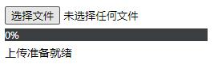

<h1 align="center">
    Vue 3 chunk upload
</h1>

<p align="center">
    <a href="https://www.npmjs.com/package/@orh/vue-chunk-upload">
        
    </a>
    <a href="https://www.npmjs.com/package/@orh/vue-chunk-upload">
        
    </a>
    <a href="https://github.com/ouronghuang/vue-chunk-upload">
        
    </a>
</p>

* 适用于 Vue 3 的分片上传扩展
* 可以配合 [orh/laravel-chunk-upload](https://github.com/ouronghuang/laravel-chunk-upload) 使用



## Vue 3.x

1. 安装

```bash
$ yarn add @orh/vue-chunk-upload
```

2. 引入

```javascript
import { createApp } from 'vue';
import App from './App.vue';
import VueChunkUpload from '@orh/vue-chunk-upload';

createApp(App).use(VueChunkUpload).mount('#app')
```

3. 使用

[示例代码](./src/App.vue)

- Props

| 属性 | 说明 | 类型 | 默认值 |
| --- | --- | --- | --- |
| `model-value` | 成功上传的文件路径，可以使用 `v-model` 双向绑定 | `String` | 空 |
| `preprocess-url` | 预处理地址 | `String` | `required` |
| `upload-url` | 上传地址 | `String` | `required` |
| `configs` | 可传入 `axios` 所有配置 | `Object` | `{}` |
| `allow-size` | 允许上传文件大小，单位字节，`0` 表示不限制 | `Number` | `0` |
| `allow-extensions` | 允许上传的文件类型，空数组表示不限制 | `Array` | `[]` |
| `fields-name` | 上传表单字段 | `Object` | `{ filename: 'filename', size: 'size', total: 'total', index: 'index', file: 'file' }` |

- Events

| 事件 | 说明 | 回调参数 |
| --- | --- | --- |
| `invalid-size` | 文件大于设定值时抛出事件 | 错误信息 |
| `invalid-extension` | 选择不支持文件时抛出事件 | 错误信息 |
| `completed` | 上传成功时抛出事件 | 成功上传的文件路径 |

- Slots

| 名称 | 说明 | 可用参数 |
| --- | --- | --- |
| `default` | 进度与展示信息自定义 | `v-slot="{ requestProgress, totalProgress, msg }"` |

## 本地开发/预览

1. 安装依赖

```
$ yarn
```

2. 运行

```
$ yarn serve
```

## License

MIT
